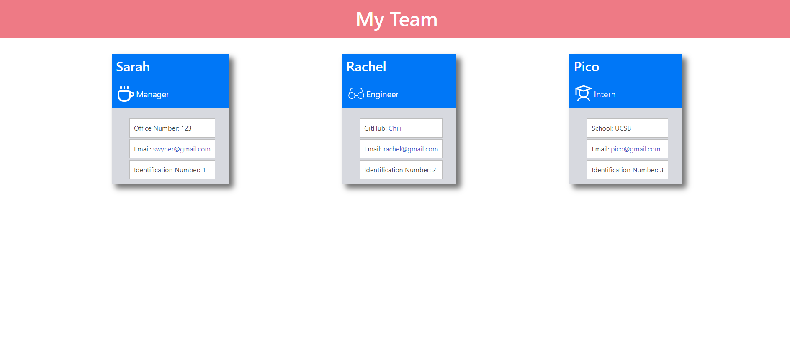

# team-profile-gen

## A command-line applicaiton ran by Node.js. This app inquires the user for information regarding employees of a team to then generate an HTML webpage that displays the users input.

  ------------------
  ## TECHNOLOGIES USED
  ### Node.js
  ### Inquirer
  ### Bulma
  ### Html
  ### CSS
  ------------------
  ## TEST  
  ### Jest
  ------------------
  ## DEPLOYMENT 
  https://swyner97.github.io/team-profile-gen/
  https://github.com/swyner97/team-profile-gen

  ## DEMO VIDEO 

[Click me](https://drive.google.com/file/d/1bx7jgkDbulgVYlA3HjNFu8xgH1Q-JYrG/view)